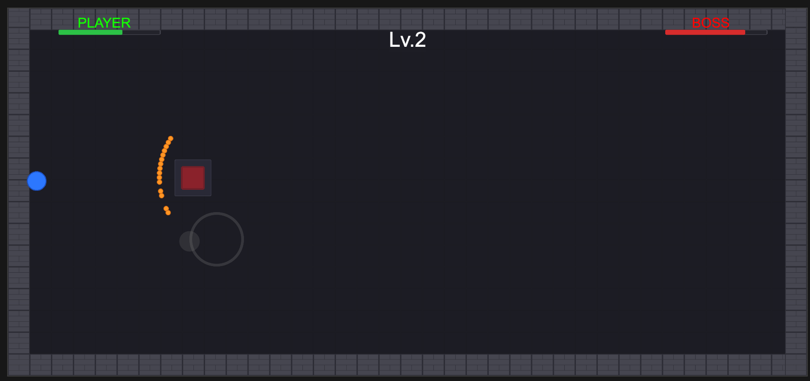

# Bullet Hell Boss Fight

2D top-down bullet hell demo built with Cocos Creator 3.7.4 | TypeScript | Zero third-party packages

## Demo

<!-- Replace with actual screenshot -->


**[Play Web Build]()** | **[Download APK]()**

## Features

- **Player**: WASD/Arrow keys + touch joystick, auto-shoot, dash with invincibility frames
- **Boss AI**: 3-phase FSM (High/Medium/Low HP) with escalating aggression
  - NormalMove → DashMove, NormalShoot (6-bullet fan) → CrazyShoot (18-bullet fan)
- **Bullet System**: ECS-inspired architecture — pure data components (BulletData) processed by independent systems (BulletSystem, CollisionSystem), object pool with SpriteFrame swap, no per-frame getComponent
- **Game Flow**: Start → Play → Win/Lose → Restart, multi-level progression (3 levels)
- **HUD**: Real-time HP bars, level indicator
- **Audio**: Event-driven AudioManager — BGM during gameplay, SFX on hits/explosions/dash
- **Visual Feedback**: Hit flash, boss phase sprite changes, intro/death animations

## Architecture Highlights

| Area | Approach |
|------|----------|
| Bullet System | ECS-inspired: data components + systems, single pool with SpriteFrame swap |
| Boss AI | FSM with phase-based action queues (NormalMove, DashMove, NormalShoot, CrazyShoot) |
| Collision | Manual circle-circle check using squared distance — no physics engine overhead |
| Events | Typed pub/sub EventManager for decoupled cross-system communication |
| Config | Pure data GameConfig (no engine types) — separated from logic for easy tuning |
| Input | IInputSource interface — keyboard and joystick implementations, swappable at runtime |

## Project Structure

```
assets/scripts/
├── config/       # GameConfig (pure data, no cc imports)
├── core/         # GameManager, EventManager, TransitionController
├── bullet/       # BulletData, BulletPool, BulletSystem, CollisionSystem, BulletFactory
├── boss/         # BossController, BossFSM, BossVisual, actions/
├── player/       # PlayerController, PlayerDash, PlayerVisual, input/
├── entity/       # HealthComponent, ShootComponent
├── level/        # LevelConfig, LevelManager
├── map/          # ArenaManager
├── audio/        # AudioManager
└── ui/           # HUDManager, ScreenManager
```

## Getting Started

> Requires **Cocos Creator 3.7.4**

1. Clone the repository
2. Open `Shooter/Contra/` folder in Cocos Creator
3. Open `assets/scenes/GameScene.scene`
4. Click **Play** in the editor
